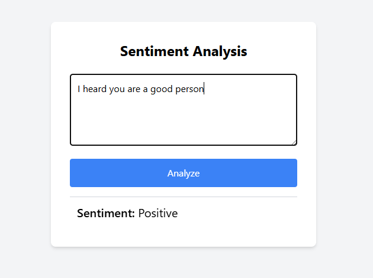

# Sentiment Analysis App

This is a simple sentiment analysis web application built using Flask, Hugging Face Transformers, TensorFlow, and styled with Tailwind CSS. The app takes a sentence as input and predicts whether the sentiment is positive or negative.

## Features

- Sentiment analysis using a pre-trained transformer model.
- Web interface styled with Tailwind CSS.
- Simple and easy-to-use interface.

## Installation

### Prerequisites

- Python 3.6+
- `pip` (Python package installer)

### Steps

1. **Clone the repository**

   ```sh
   git clone https://github.com/neuralsorcerer/sentiment-analysis-app.git
   cd sentiment-analysis-app
   ```

2. **Create a virtual environment**

   ```sh
   python -m venv venv
   ```

3. **Activate the virtual environment**

   - On Windows:

     ```sh
     venv\Scripts\activate
     ```

   - On macOS and Linux:

     ```sh
     source venv/bin/activate
     ```

4. **Install dependencies**

   ```sh
   pip install -r requirements.txt
   ```

5. **Run the Flask app**

   ```sh
   python app.py
   ```

6. **Open your browser**

   Navigate to `http://127.0.0.1:5000/` to access the web application.

## Usage

- Enter a sentence in the text area provided.
- Click the "Analyze" button.
- The app will display whether the sentiment of the entered sentence is positive or negative.


